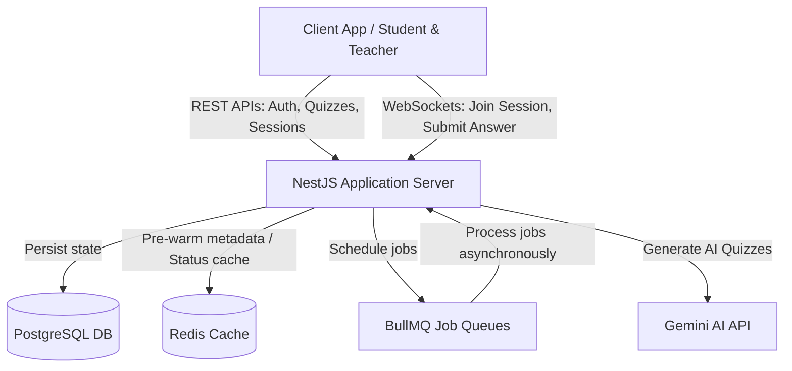
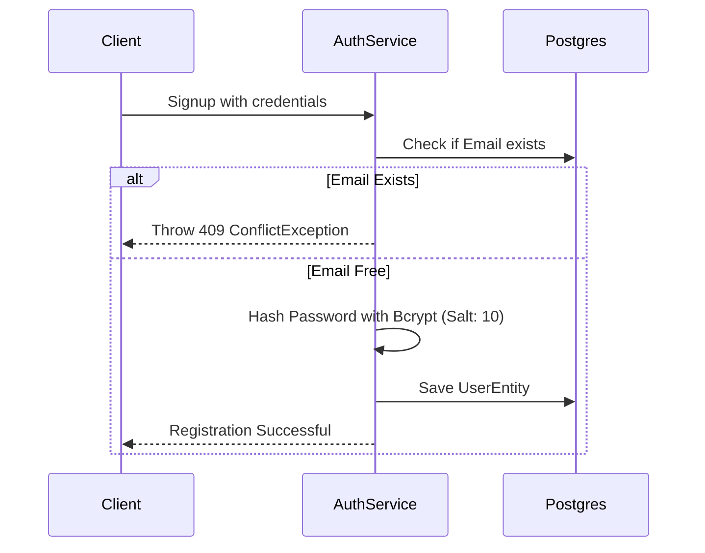
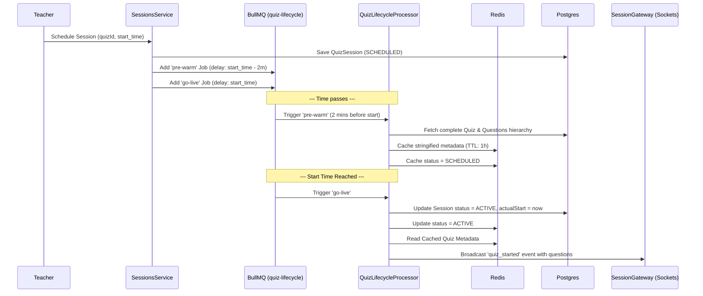
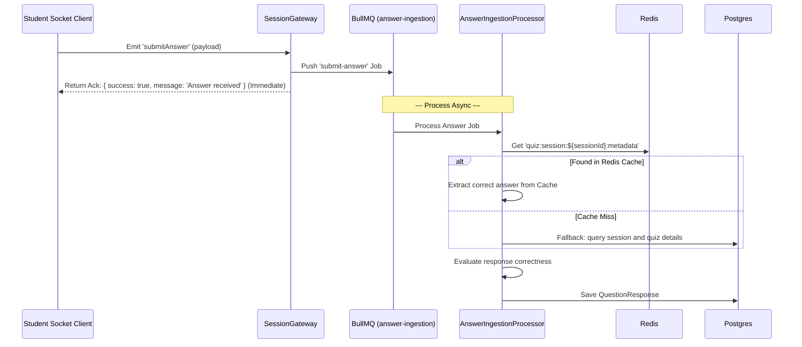

# QuizForge Backend Architecture & DB Design Specification

This document provides a detailed breakdown of the architectural decisions, database models, database normalization rules, core business logic, and test/edge cases implemented in the **QuizForge** backend.

---

## 1. System Architecture Overview

QuizForge is designed as a hybrid architecture combining a high-performance **Request-Response (REST) model** for administrative actions with an **Event-Driven Architecture (EDA) & asynchronous worker queue system** for real-time, high-concurrency quiz sessions.

### Key Architectural Pillars

1. **NestJS Framework**: Used as the core framework utilizing Dependency Injection (DI) to build decoupled, maintainable, and testable modules (`AuthModule`, `QuizzesModule`, `SessionsModule`, `RedisModule`, `GeminiModule`).
2. **Double-Token Authentication & Cookie Security**: Implements an HTTP-only, signed, lax cookie approach for JWT token delivery to mitigate Cross-Site Scripting (XSS) and Cross-Site Request Forgery (CSRF).
3. **Dual Database Store**:
   - **PostgreSQL**: Serving as the relational, transactional ground truth database managed via **TypeORM**.
   - **Redis**: Used for high-speed, volatile storage (caching quiz session metadata, session status, and handling rate-limiting counters).
4. **Queue-Based Asynchronous Operations**: Driven by **BullMQ** (backed by Redis) to process CPU-intensive, high-throughput, or time-delayed operations (such as pre-warming databases, going live, and digesting student answers) without clogging the event loop.
5. **Real-time WebSockets**: Uses **Socket.io** (`@nestjs/websockets`) for bidirectional, low-latency communication (joining rooms, launching quizzes, sending prompt updates).
6. **Robust AI Integration**: Connects with **Gemini AI** (`gemini-1.5-flash`) to generate structured quizzes from arbitrary topics, protected by strict rate limits and parsing guards.

---

## 2. Database Decisions & Schema Normalization

### DB Decisions

- **PostgreSQL**: Chosen for its robust support for ACID transactions, complex relational queries (e.g., joining user, quiz, and response logs), and strong support for **JSONB** columns to store semi-structured data (like question options and correct answer schemas).
- **Redis**: Used as a caching layer to avoid heavy SQL reads during live sessions. For example, when 1,000 students join a quiz at the exact same second, querying PG for question data would choke the database. Pre-warming this metadata in Redis resolves this bottleneck.

### Database Normalization Analysis

The database is fully normalized to **Third Normal Form (3NF)** to eliminate data redundancy and prevent insert/update/delete anomalies.

1. **First Normal Form (1NF)**:
   - Every column contains atomic values.
   - Every table has a primary key (typically UUID).
   - Semi-structured lists like quiz tags use PostgreSQL native text arrays (`text[]`).
2. **Second Normal Form (2NF)**:
   - All non-key attributes are fully functionally dependent on the primary key.
   - Standard relational tables are separated. For instance, questions are stored in a dedicated `questions` table rather than directly inside `quizzes` or `question_bundles`.
3. **Third Normal Form (3NF)**:
   - Transitive dependencies are removed. No non-key column depends on another non-key column.
   - For example, participant rankings and session statuses are stored in their respective tables (`quiz_participants` and `quiz_sessions`) mapping foreign keys back to `UserEntity` and `quizzes`.

### Cloned-Question Isolation (Crucial Design Choice)

Instead of referencing the same `questionId` directly from a shared repository or bank, creating a Quiz from a Question Bundle **deeply copies (clones)** each question record.

- **Why?** If a teacher creates Quiz A from Bundle B, and later edits a question in Bundle B, Quiz A's history and active status must not be impacted. Cloned isolation preserves the integrity of active quizzes and historical responses.

---

### Entity Relationship & Tables Schema

#### A. User Module

- **`UserEntity` (Table: `UserEntity`)**
  - Represents registered users (Teachers and Students).
  - Schema:
    - `uid`: UUID (PK)
    - `name`: VARCHAR(100)
    - `email`: VARCHAR(255) (Unique, indexed)
    - `passwordHash`: TEXT (nullable for OAuth users)
    - `role`: ENUM ('STUDENT', 'TEACHER')
    - `oauthProvider`: VARCHAR(50) (e.g., 'google')
    - `oauthId`: VARCHAR(255)
    - `isActive`: BOOLEAN
    - `createdAt`: TIMESTAMP

#### B. Quizzes Module

- **`Quiz` (Table: `quizzes`)**
  - Schema:
    - `quizId`: UUID (PK)
    - `title`: VARCHAR(255)
    - `description`: TEXT
    - `createdBy`: FK -> `UserEntity(uid)`
    - `status`: ENUM ('DRAFT', 'PUBLISHED', 'ARCHIVED')
    - `visibility`: ENUM ('PUBLIC', 'PRIVATE')
    - `tags`: TEXT[] (Indexed via GIN indexes for fast tags-based search)
    - `createdAt` / `updatedAt`: TIMESTAMP
- **`Question` (Table: `questions`)**
  - Atomic question definitions.
  - Schema:
    - `questionId`: UUID (PK)
    - `title`: TEXT
    - `type`: ENUM ('MULTIPLE_CHOICE', 'TRUE_FALSE', 'SHORT_ANSWER')
    - `options`: JSONB (Flexible storage for options list, e.g., string arrays or key-value pairs)
    - `correctAnswer`: JSONB (Supports multiple structures depending on type: indexes, true/false values, or text answers)
    - `points`: INT
- **`QuizQuestion` (Table: `quiz_questions`)**
  - Bridge table representing a Many-to-Many relationship between `quizzes` and `questions` to maintain display ordering.
  - Schema:
    - `id`: UUID (PK)
    - `quizId`: FK -> `quizzes(quizId)` (Cascade delete)
    - `questionId`: FK -> `questions(questionId)` (Cascade delete)
    - `displayOrder`: INT
- **`QuestionBundle` (Table: `question_bundles`)**
  - Collection of questions for teachers to store and re-use.
  - Schema:
    - `bundleId`: UUID (PK)
    - `title`: VARCHAR(255)
    - `description`: TEXT
    - `visibility`: ENUM ('PUBLIC', 'PRIVATE')
    - `tags`: TEXT[] (Indexed)
    - `createdBy`: FK -> `UserEntity(uid)`
- **`BundleQuestion` (Table: `bundle_questions`)**
  - Bridge table representing a Many-to-Many relationship between `question_bundles` and `questions`.
  - Schema:
    - `id`: UUID (PK)
    - `bundleId`: FK -> `question_bundles(bundleId)` (Cascade delete)
    - `questionId`: FK -> `questions(questionId)` (Cascade delete)
    - `displayOrder`: INT

#### C. Sessions Module

- **`QuizSession` (Table: `quiz_sessions`)**
  - Represents a live running instance of a quiz.
  - Schema:
    - `sessionId`: UUID (PK)
    - `quizId`: FK -> `quizzes(quizId)`
    - `createdBy`: FK -> `UserEntity(uid)`
    - `joinCode`: VARCHAR(10) (Unique, index-optimized)
    - `accessType`: ENUM ('OPEN', 'CODE_ONLY', 'INVITE_ONLY')
    - `status`: ENUM ('SCHEDULED', 'ACTIVE', 'COMPLETED')
    - `scheduledStart`: TIMESTAMP
    - `actualStart`: TIMESTAMP
    - `endTime`: TIMESTAMP
    - `timeLimit`: INT (in seconds)
- **`QuizParticipant` (Table: `quiz_participants`)**
  - Links users who join a specific session.
  - Schema:
    - `participantId`: UUID (PK)
    - `sessionId`: FK -> `quiz_sessions(sessionId)`
    - `userId`: FK -> `UserEntity(uid)`
    - `inviteId`: FK -> `quiz_invites(inviteId)` (Nullable)
    - `joinedAt` / `leftAt`: TIMESTAMP
    - `status`: ENUM ('JOINED', 'ACTIVE', 'COMPLETED', 'LEFT')
    - `finalScore`: INT
    - `ranking`: INT
- **`QuizInvite` (Table: `quiz_invites`)**
  - Session invitations.
  - Schema:
    - `inviteId`: UUID (PK)
    - `sessionId`: FK -> `quiz_sessions(sessionId)`
    - `invitedBy`: FK -> `UserEntity(uid)`
    - `userId`: FK -> `UserEntity(uid)` (Nullable)
    - `email`: VARCHAR(255) (For external email invites)
    - `status`: ENUM ('PENDING', 'ACCEPTED', 'REJECTED')
    - `invitedAt` / `respondedAt`: TIMESTAMP

#### D. Responses & Analytics Module

- **`QuestionResponse` (Table: `question_responses`)**
  - Student submitted answers.
  - Schema:
    - `responseId`: UUID (PK)
    - `sessionId`: FK -> `quiz_sessions(sessionId)`
    - `questionId`: FK -> `questions(questionId)`
    - `userId`: FK -> `UserEntity(uid)`
    - `response`: TEXT (User submitted value)
    - `isCorrect`: BOOLEAN
    - `pointsScored`: INT
    - `submittedAt`: TIMESTAMP
    - `timeTakenSecs`: INT
- **`ResponseAggregation` (Table: `response_aggregations`)**
  - Aggregated stats per question for real-time analytics graphs.
  - Schema:
    - `aggregateId`: UUID (PK)
    - `sessionId`: FK -> `quiz_sessions(sessionId)`
    - `questionId`: FK -> `questions(questionId)`
    - `selectedOption`: VARCHAR(100)
    - `responseCount`: INT
    - `percentage`: DECIMAL(5,2)
    - `isCorrectOption`: BOOLEAN
    - `lastUpdated`: TIMESTAMP
- **`LeaderboardSnapshot` (Table: `leaderboard_snapshots`)**
  - Real-time standings.
  - Schema:
    - `snapshotId`: UUID (PK)
    - `sessionId`: FK -> `quiz_sessions(sessionId)`
    - `userId`: FK -> `UserEntity(uid)`
    - `currentScore`: INT
    - `questionsAnswered`: INT
    - `ranking`: INT
    - `studentName`: VARCHAR(100)
    - `lastUpdated`: TIMESTAMP

---

## 3. Core Backend Logic Flow & Design Decisions

### A. Authentication & Security Logic

#### Pre-Account Takeover Protection (OAuth Mitigation)

An exploit exists where an attacker signs up using a teacher's email address (e.g. `professor@university.edu`) via password login _before_ the teacher creates their account using Google OAuth. If the teacher later registers via Google OAuth, the system might link the accounts, letting the attacker log in with their pre-established password.

- **How we handle it**:
  When a Google OAuth validation happens, we look up the email. If the user already exists and was registered via password (`passwordHash !== ''` and `oauthProvider` is not set):
  1. We clear `passwordHash` (force password removal).
  2. We set `oauthProvider = 'google'`.
  3. This links the profile safely and permanently disables the insecure password vector, neutralizing pre-account takeover.

#### Dual Token Cookies

- Tokens are issued in pairs: **AccessToken (15-min expiry)** and **RefreshToken (7-day expiry)**.
- Instead of returning them in the response body, they are stored in **HTTP-only, signed, lax cookies** (`jwt`, `refresh_token`), protecting tokens from access by malicious frontend JS scripts.

---

### B. High-Performance Quiz Session Lifecycle (Pre-Warming & Go-Live)

To scale live quizzes, we separate the resource-intensive database fetching from the real-time event loop.

1. **Pre-Warming (2 minutes before start)**:
   - Triggers `pre-warm` worker job.
   - Fetches the complete quiz structure, options, correct answers, and points from PostgreSQL.
   - Caches it in Redis under `quiz:session:${sessionId}:metadata` (TTL: 1 hour).
   - _Result_: Zero DB reads needed when students load the quiz at start time.
2. **Go-Live (Exactly at start time)**:
   - Triggers `go-live` worker job.
   - Updates PostgreSQL `status` to `ACTIVE` and records `actualStart`.
   - Sets Redis status to `ACTIVE`.
   - Broadcasts `quiz_started` containing all questions and session rules to the WebSocket room `session_${sessionId}`.

---

### C. Low-Latency Answer Ingestion & Evaluation

Ingesting answers synchronously is a bottleneck. QuizForge uses an asynchronous ingestion pipe.

1. **Immediate Ingestion (WebSockets Gateway)**:
   - Client sends `submitAnswer` through the Socket connection.
   - The gateway instantly pushes the payload to the BullMQ queue (`answer-ingestion`).
   - The gateway returns an immediate success acknowledgement. **Connection remains free and unblocked.**
2. **Asynchronous Evaluation (BullMQ Worker)**:
   - The worker processes the job.
   - It attempts to read quiz details from the **Redis Cache** (key: `quiz:session:${sessionId}:metadata`). If missing, it falls back to PostgreSQL.
   - Correctness is evaluated using type-tolerant validation logic:
     - **String comparison**: Standardized by trimming and lower-casing both strings.
     - **Number comparison**: Coerces the string response to a JavaScript `Number` for matching.
     - **Boolean comparison**: Compares the boolean value to string representations of `'true'`/`'false'`.
     - **Objects/Arrays**: Compares using strict serialization comparison (`JSON.stringify`).
   - The score is updated, and a `QuestionResponse` record is inserted into the SQL database.

---

## 4. Edge Cases & Test Scenarios Handled

During development, several complex scenarios were resolved:

| Test Scenario / Edge Case     | Business Impact / Exploit Vector                                                                                       | Technical Mitigation / How it is Handled                                                                                                                                                                                    |
| :---------------------------- | :--------------------------------------------------------------------------------------------------------------------- | :-------------------------------------------------------------------------------------------------------------------------------------------------------------------------------------------------------------------------- |
| **Pre-Account Takeover**      | Attacker registers teacher's email with a password before the teacher signs up with Google OAuth.                      | Google OAuth sign-in automatically detects if the email already exists, clears out the insecure `passwordHash`, and updates the login provider to `google`.                                                                 |
| **Database Read Spike**       | Hundreds or thousands of students joining a live quiz at the same time triggers massive concurrent DB read operations. | BullMQ schedules a `pre-warm` task 2 minutes before the quiz starts to cache all quiz metadata in Redis. Students read from Redis, preserving PostgreSQL resources.                                                         |
| **Delayed Answer Processing** | Slow execution of answer processing blocks websocket queues, causing timeouts for other students.                      | The websocket gateway returns an immediate `success: true` acknowledgement and offloads evaluation to BullMQ for asynchronous background ingestion.                                                                         |
| **System Time Tampering**     | Students tamper with their local browser clock to submit answers past the question limit.                              | The server logs the submission timestamp at the moment it reaches the WebSocket gateway and compares it with the server's time limits, bypassing browser clock manipulation.                                                |
| **Loose-Type Answers**        | Evaluation fails because the correct answer is saved as a number/boolean in Postgres but submitted as a string.        | `evaluateAnswer()` performs automatic type conversion checking. It handles numeric checks, boolean matches (e.g. `"true"` is evaluated as `true`), and trims/lowercases strings.                                            |
| **Orphaned Questions**        | Deleting a Quiz or a Bundle leaves unused Question records cluttering the database.                                    | Cascade constraints are defined on bridge records. Additionally, the service explicitly deletes independent question entities when removing them from a quiz or bundle.                                                     |
| **Gemini AI Bad Output**      | AI returns Markdown markers (fences) or invalid JSON format, breaking parsing logic.                                   | The service strips Markdown syntax (`json ... `), extracts strings matching the `{ ... }` bounds, validates the internal structure, filters options, checks option counts, and retries with exponential backoff on failure. |
| **AI Generation Spam**        | A user spams the Gemini generation endpoint, resulting in high API bills or rate-limits.                               | A custom NestJS throttler guard `GeminiThrottle` limits AI generation calls to a maximum of 5 requests per minute, throwing a `ThrottlerException` if exceeded.                                                             |

///

## Action Items — Status Tracker

### ✅ Completed

#### Auth Module

- [x] Email/password registration with bcrypt hashing
- [x] Email/password login with JWT token generation
- [x] Google OAuth sign-in / sign-up flow
- [x] JWT access token (240 min expiry) via signed httpOnly cookies
- [x] JWT refresh token (7 day expiry) via signed httpOnly cookies
- [x] Refresh token endpoint for access token renewal
- [x] Logout (cookie clearing)
- [x] `@CurrentUser` param decorator to extract authenticated user
- [x] `@Roles` decorator + `RoleGuard` for role-based access control
- [x] `jwtAuthGuard` for protecting routes
- [x] Google OAuth guard
- [x] Role update endpoint (`PATCH /auth/role`)
- [x] `GET /auth/me` — check login status

#### Quizzes Module

- [x] Create question bundle (with optional inline questions)
- [x] Get single bundle with all questions (sorted by displayOrder)
- [x] List bundles — own bundles or public bundles (via `?public=true`)
- [x] Filter bundles by tags (via `?tags=js,react`)
- [x] Update bundle metadata (title, description, visibility, tags)
- [x] Delete bundle (with cascade)
- [x] Add question to existing bundle
- [x] Update question in bundle (both question content and displayOrder)
- [x] Delete question from bundle (cleans up orphaned Question)
- [x] Create quiz from scratch (with inline questions)
- [x] Create quiz from existing bundle (deep-clones questions)
- [x] Get single quiz with all questions (sorted by displayOrder)
- [x] Update quiz metadata (title, description, status, visibility, tags)
- [x] Delete quiz (with cascade)
- [x] Add question to existing quiz
- [x] Update quiz question (both question content and displayOrder)
- [x] Delete quiz question (cleans up orphaned Question)
- [x] Ownership validation on all CRUD operations (ForbiddenException)

#### Sessions Module

- [x] Schedule a quiz session (`POST /sessions/schedule`)
- [x] Generate unique 6-char alphanumeric join code
- [x] BullMQ pre-warm job (caches quiz metadata to Redis 2 min before start)
- [x] BullMQ go-live job (sets status to ACTIVE, broadcasts `quiz_started`)
- [x] Socket.IO gateway with `joinSession` event (UUID or join code)
- [x] Socket.IO gateway with `submitAnswer` event
- [x] Answer ingestion processor (evaluates correctness, saves to DB)
- [x] Late-join support (sends quiz data if session already ACTIVE)
- [x] `broadcastToSession` helper for processors to emit to rooms

#### Gemini AI Module

- [x] `POST /gemini/generate-quiz` — AI quiz generation from topic
- [x] Configurable difficulty (easy / medium / hard) and question count (1-50)
- [x] Robust prompt engineering for consistent JSON output
- [x] JSON response parsing with markdown code block stripping
- [x] Full quiz validation & sanitization (title, questions, options, correctAnswer match)
- [x] Retry logic with exponential backoff (up to 3 attempts)
- [x] Gemini-specific throttle guard (5 req / 60 sec)
- [x] Role-restricted to `TEACHER` only

#### User Module

- [x] `GET /user/profile` — get current user's profile (JWT-protected)

#### Redis Module

- [x] Global Redis service with `get`, `set` (with optional TTL), `del`, `getClient`
- [x] Lifecycle hooks (`onModuleInit` / `onModuleDestroy`)

#### Data Model / Entities

- [x] `User` entity (UUID PK, email unique, role enum, OAuth fields)
- [x] `Quiz` entity (status, visibility, tags array, timestamps)
- [x] `Question` entity (type enum, jsonb options & correctAnswer)
- [x] `QuizQuestion` bridge entity (quiz ↔ question with displayOrder)
- [x] `QuestionBundle` entity (visibility, tags with GIN index)
- [x] `BundleQuestion` bridge entity (bundle ↔ question with displayOrder)
- [x] `QuizSession` entity (joinCode, accessType, status, scheduling fields)
- [x] `QuizParticipant` entity (status, finalScore, ranking)
- [x] `QuizInvite` entity (invitedBy, status, email)
- [x] `QuestionResponse` entity (response, isCorrect, pointsScored, timeTakenSecs)
- [x] `LeaderboardSnapshot` entity (currentScore, ranking, studentName)
- [x] `ResponseAggregation` entity (selectedOption, responseCount, percentage)

#### Infrastructure

- [x] Global `ConfigModule` for environment variable management
- [x] Global `ValidationPipe` (whitelist, forbidNonWhitelisted, transform)
- [x] Global rate limiting via `ThrottlerModule` (5 req / 60 sec)
- [x] CORS enabled
- [x] Cookie parser with signed cookies
- [x] BullMQ integration with Redis for background job queues
- [x] `ScheduleModule` imported (ready for cron jobs)

---

### 🔲 Pending

#### 🔴 Critical — Security Fixes

- [ ] **Secure cookies for production** — Set `secure: true` on both `jwt` and `refresh_token` cookies ([auth.service.ts:240-254](src/auth/auth.service.ts))
- [ ] **Restrict CORS origin** — Change `origin: true` to `process.env.FRONTEND_URL` in production ([main.ts:11](src/main.ts))
- [ ] **Authenticate WebSocket connections** — Add JWT verification to Socket.IO gateway `handleConnection`. Currently, any client can join sessions and submit answers without proving identity ([session.gateway.ts](src/sessions/events/session/session.gateway.ts))
- [ ] **Verify userId from JWT on `submitAnswer`** — Currently userId is taken from the message body (client-controlled). Must extract from verified JWT instead
- [ ] **Fix privilege escalation on `PATCH /auth/role`** — Any logged-in user can change their own role to TEACHER or ADMIN. Add guard to restrict this to new/roleNeeded users only ([auth.controller.ts:86-94](src/auth/auth.controller.ts))
- [ ] **Fix account takeover via Google OAuth** — The "Pre-Account Takeover Protection" logic actually enables takeover by clearing password hash when a matching Google email logs in ([auth.service.ts:190-195](src/auth/auth.service.ts))
- [ ] **Enable SSL certificate verification on DB** — `rejectUnauthorized: false` disables TLS verification on PostgreSQL connection ([app.module.ts:29-31](src/app.module.ts))

#### 🟠 High — Correctness Bugs

- [ ] **Fix `register()` not returning tokens** — Tokens are generated but never set as cookies or returned in the response. Users don't get auto-logged-in after registration ([auth.service.ts:30-59](src/auth/auth.service.ts))
- [ ] **Fix `register()` error handling** — Catch block swallows the original `ConflictException` and throws a generic one, losing context ([auth.service.ts:57-59](src/auth/auth.service.ts))
- [ ] **Fix typo `messsage` → `message`** — Misspelled in two response objects ([auth.service.ts:55](src/auth/auth.service.ts), [auth.service.ts:222](src/auth/auth.service.ts))
- [ ] **Fix falsy-value bug in quiz/bundle question updates** — Using `||` instead of explicit `undefined` checks causes `points: 0` or `options: []` to be skipped ([quizzes.service.ts:208-223](src/quizzes/quizzes.service.ts), [quizzes.service.ts:419-434](src/quizzes/quizzes.service.ts))
- [ ] **Fix UUID vs join-code detection** — Current `length > 10` check is fragile. Use a proper UUID regex ([session.gateway.ts:48](src/sessions/events/session/session.gateway.ts))

#### 🟡 Medium — Missing Features

- [ ] **Add `GET /quizzes` endpoint** — List all quizzes for the current user (like bundles listing already supports)
- [ ] **Session end/completion flow** — Add `go-end` BullMQ job that fires after `timeLimit` expires, transitions status to `COMPLETED`, calculates final scores
- [ ] **QuizParticipant tracking** — Create `QuizParticipant` records when users join via WebSocket. Currently entity exists but is never populated
- [ ] **Implement Responses module** — Add endpoints for retrieving a user's answers, session results, answer history per question. Service is empty shell
- [ ] **Implement Analytics module** — Add endpoints for leaderboards, response aggregations, per-question analytics. Service is empty shell
- [ ] **Add invite system** — Implement `QuizInvite` workflows (send invite, accept/reject, INVITE_ONLY access type enforcement). Entity exists but is unused
- [ ] **Enforce `accessType`** — `OPEN`, `CODE_ONLY`, `INVITE_ONLY` are defined but not checked in `joinSession`. All sessions are effectively open
- [ ] **Use `ConfigService` for DB config** — Migrate `TypeOrmModule.forRoot` to use `forRootAsync` with injected `ConfigService` instead of raw `process.env` ([app.module.ts:26-35](src/app.module.ts))
- [ ] **Add refresh token endpoint to controller** — `refreshToken()` exists in service but no controller route exposes it
- [ ] **WebSocket CORS from env** — Gateway CORS is hardcoded to `localhost:3000`. Should read from `FRONTEND_URL` env variable ([session.gateway.ts:20-24](src/sessions/events/session/session.gateway.ts))

#### 🟢 Low — Code Quality & Cleanup

- [ ] **Replace `synchronize: true` with migrations** — Auto-sync can cause data loss in production ([app.module.ts:33](src/app.module.ts))
- [ ] **Add a health check endpoint** — Use the empty `AppController` for `GET /health` ([app.controller.ts](src/app.controller.ts))
- [ ] **Remove unused `@google/genai` package** — Only `@google/generative-ai` is used ([package.json:23](package.json))
- [ ] **Remove unused `mysql2` package** — App uses PostgreSQL only ([package.json:43](package.json))
- [ ] **Remove unused `GoogleAuthGuard`** — Controller uses `AuthGuard('google')` directly ([google-auth.guard.ts](src/auth/guards/google-auth/google-auth.guard.ts))
- [ ] **Clean up commented-out enums** — Enums in `common/enums/enum.ts` are all commented out; they've been redefined in entities ([enum.ts](src/common/enums/enum.ts))
- [ ] **Delete empty `JoinSessionDto`** — Class is empty and unused ([join-session.dto.ts](src/sessions/dto/join-session.dto/join-session.dto.ts))
- [ ] **Add type annotation to `user.controller.ts`** — `@Req() req` is missing `Request` type ([user.controller.ts:11](src/user/user.controller.ts))
- [ ] **Remove `eslint-disable` directives** — Fix underlying type issues instead of suppressing (15+ occurrences across codebase)
- [ ] **Bulk insert questions** — Replace sequential `for` loop `save()` calls with bulk `save([])` for quiz/bundle creation ([quizzes.service.ts:302-322](src/quizzes/quizzes.service.ts))
- [ ] **Separate secrets for access/refresh tokens** — Both currently use the same `JWT_SECRET`, meaning a refresh token could theoretically be used as an access token ([auth.service.ts:132-161](src/auth/auth.service.ts))
- [ ] **Add `disableErrorMessages: true` for production** — Comment in code already notes this ([main.ts:24](src/main.ts))

---
